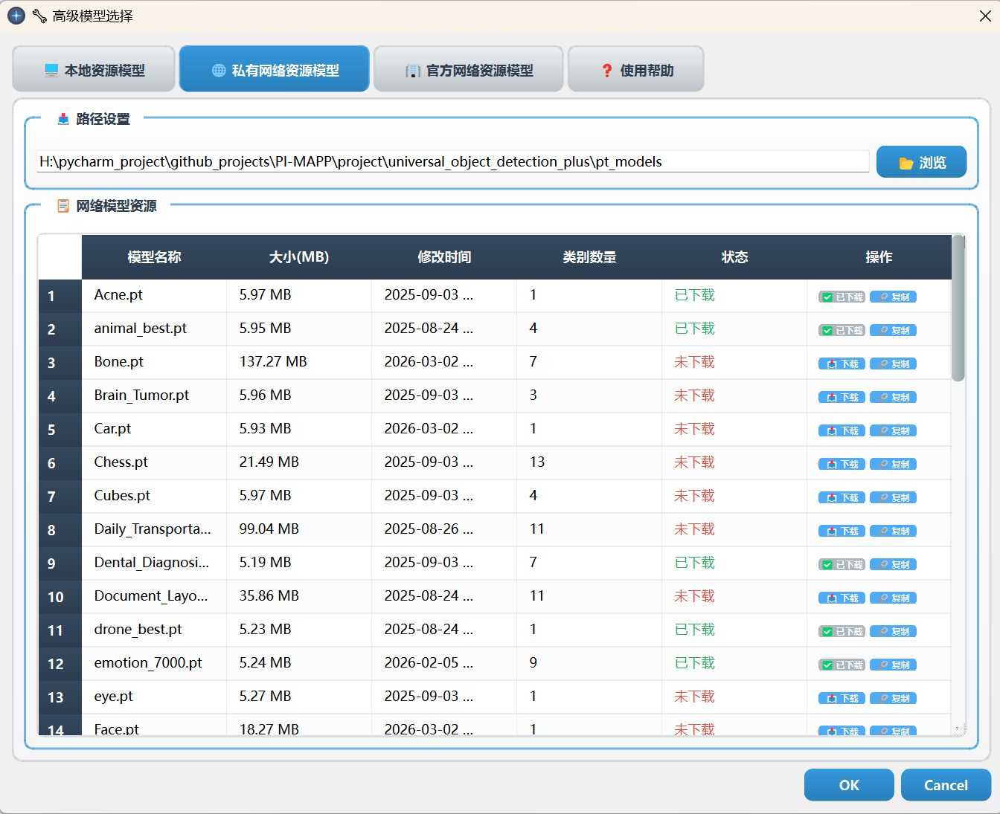

# Dimension Object Detection System

一个全面优化的通用目标检测系统，基于YOLO，具有现代化渐变UI和强大功能。

- [预测效果](README_UI_demo.md)

---


---

## 无脑软件运行（windows）

可执行包 3GB左右 下载即用 无需再配置环境 内置了运行目标检测所有的一切环境

<div align="center">

</div>

## 源码运行

### 1. 获取源码

由于该项目是[PI-MAPP](https://github.com/JingW-ui/PI-MAPP)下的子项目，如您直接clone整个源码，会有不需要的项目存在
如您在意这个可使用下列相关操作

```commandline
git clone --no-checkout https://github.com/JingW-ui/PI-MAPP.git
cd PI-MAPP
git sparse-checkout init --cone
git sparse-checkout set project/universal_object_detection_plus
git checkout main  # 或者你需要的分支名称，如 master
```

如您需要[PI-MAPP](https://github.com/JingW-ui/PI-MAPP)项目的整个源码，请使用以下命令

```commandline
git clone https://github.com/JingW-ui/PI-MAPP.git
```

### 2. 配置环境

```commandline
pip install -r requirements.txt
```

### 3. 启动应用程序

```bash
# 运行主程序
python enhanced_ui_main.py

```

## 👿 界面预览


---

### 特殊说明（模型权重相关）

- 您可以使用自己数据集训练的YOLO权重（没改变模型结构）
- 也可以直接从软件中下载权重，[私有权重](DATA_INTRODUCTION.md)有40多个，官方权重有30多个，还在持续更新中,[视频教程](https://www.bilibili.com/video/BV1JYw4zYEdL?vd_source=ea444bcb59e16e58cfdca990f3514384&spm_id_from=333.788.videopod.sections)
  

### 权重和数据获取技巧

kaggle: https://www.kaggle.com
该网页中有非常多的公开数据集，可以说没有你找不到的 只有你想不到的。
找到数据集后，可以在网页中下载数据集在本地训练（可直接在kaggle中训练），也可找到数据集相关的code,查看其output 运气好可直接下载对应数据集的权重

---

🔗 **打赏支付方式**：

<div align="center">


</div>

🌟 **私人定制**：如有特殊需求，可联系邮箱 2642144249@qq.com 进行定制，我们将根据您的需求提供专属服务。

## 基本使用流程

1. **选择模型**: 在"模型配置"中选择要使用的YOLO模型
2. **设置置信度**: 调整置信度阈值（默认0.25）
3. **选择检测源**:
   - 📷 单张图片：选择图片文件进行检测
   - 🎬 视频文件：选择视频文件逐帧检测
   - 📹 摄像头：实时摄像头检测
   - 📂 文件夹批量：批量处理文件夹中的图片
4. **开始检测**: 点击"开始检测"按钮
5. **查看结果**: 在相应标签页查看检测结果

## 📖 详细功能说明

### 🎯 实时检测页面

- **原图显示**: 显示原始图像或视频帧
- **结果展示**: 显示带有检测框和标签的结果图像
- **详情面板**: 表格形式显示每个检测目标的详细信息
- **实时统计**: 显示检测数量、平均置信度等统计信息

### 📊 批量结果页面

- **结果导航**: 使用前进/后退按钮浏览批量检测结果
- **信息显示**: 显示当前图片的文件名、检测数量等信息
- **批量保存**: 一键保存所有检测结果图片和报告
- **进度跟踪**: 实时显示批量处理的进度

### 🖥️ 实时监控页面

- **多摄像头**: 同时连接和监控多个摄像头设备
- **网格显示**: 自动排列多个视频流的显示区域
- **独立控制**: 每个摄像头可以独立控制开始/停止（TODO）
- **状态监控**: 显示连接状态、检测数量、处理速度等

### 📋 运行日志

- **时间戳**: 每条日志都带有精确的时间戳
- **分类标识**: 使用emoji图标区分不同类型的消息
- **详细信息**: 记录检测类别、数量、耗时等详细信息
- **自动清理**: 自动限制日志数量，避免内存溢出

## ⚙️ 高级配置

### 模型配置

```python
# 支持的模型路径
MODELS_PATHS = [
    "pt_models",                    # 项目目录
    "models",                       # 通用目录
    "weights",                      # 权重目录
    "~/yolo_models",               # 用户目录
    "/usr/local/share/yolo_models", # 系统目录 (Linux)
    "C:/yolo_models",              # 系统目录 (Windows)
]
```

### 摄像头配置

```python
# 摄像头参数设置
CAMERA_SETTINGS = {
    'width': 640,        # 图像宽度
    'height': 480,       # 图像高度
    'fps': 30,          # 帧率
    'detection_fps': 10, # 检测频率
}
```

### UI样式配置

```python
# 渐变颜色配置
UI_COLORS = {
    'primary_start': '#3498db',     # 主要渐变起始色
    'primary_end': '#2980b9',       # 主要渐变结束色
    'background_start': '#f8f9fa',   # 背景渐变起始色
    'background_end': '#e9ecef',     # 背景渐变结束色
}
```

## 🔧 自定义开发

### 添加新的检测源

```python
class CustomDetectionThread(QThread):
    def __init__(self, model, custom_source):
        super().__init__()
        self.model = model
        self.custom_source = custom_source

    def run(self):
        # 实现自定义检测逻辑
        pass
```

### 扩展UI组件

```python
class CustomWidget(QWidget):
    def __init__(self):
        super().__init__()
        self.init_ui()

    def init_ui(self):
        # 自定义UI布局和样式
        pass
```

### 添加新的模型格式支持

```python
class ModelManager:
    def scan_models(self, custom_path=None):
        # 扩展支持的模型格式
        supported_formats = ['.pt', '.onnx', '.engine']
        # 实现扫描逻辑
```

## 🐛 故障排除

### 常见问题及解决方案

#### 1. 模型加载失败

```bash
错误: 模型加载失败
解决:
- 确认模型文件完整且格式正确
- 检查文件路径是否存在
- 确认ultralytics版本兼容性
```

#### 2. 摄像头无法打开

```bash
错误: 无法打开摄像头
解决:
- 检查摄像头是否被其他程序占用
- 确认摄像头驱动程序正常
- 尝试更换摄像头索引号
```

#### 3. 界面显示异常

```bash
错误: UI渲染问题
解决:
- 更新PySide6到最新版本
- 检查系统显卡驱动
- 调整系统DPI设置
```

#### 4. 内存使用过高

```bash
错误: 内存占用持续增长
解决:
- 降低检测频率
- 减小图像处理尺寸
- 定期重启长时间运行的检测
```

## 📊 性能优化建议

### 1. 硬件优化

- **GPU加速**: 使用NVIDIA显卡配合CUDA加速推理
- **内存配置**: 推荐8GB以上内存用于批量处理
- **存储空间**: 确保足够空间保存检测结果

### 2. 软件优化

- **模型选择**: 根据需求选择合适大小的模型（nano/small/medium/large/x）
- **置信度设置**: 适当提高置信度阈值减少误检
- **检测频率**: 实时检测时适当降低处理频率

### 3. 系统配置

- **虚拟环境**: 使用独立的Python环境避免依赖冲突
- **定期清理**: 定期清理临时文件和日志文件
- **系统监控**: 监控CPU、内存、GPU使用情况
- **项目打包**: pyinstaller -F -w --name YOLO_DETECTOR enhanced_ui_main.py

## 🤝 贡献指南

### 提交代码

1. Fork项目到个人仓库
2. 创建功能分支：`git checkout -b feature/new-feature`
3. 提交代码：`git commit -m "Add new feature"`
4. 推送分支：`git push origin feature/new-feature`
5. 提交Pull Request

### 报告问题

- 使用Issue模板提交问题报告
- 提供详细的错误信息和复现步骤
- 包含系统环境和依赖版本信息

### 功能建议

- 在Issue中详细描述新功能需求
- 说明功能的应用场景和预期效果
- 提供设计思路和实现建议

## 📄 许可证

本项目采用 MIT 许可证，详见 [LICENSE](LICENSE) 文件。

## 🙏 致谢

- [Ultralytics](https://github.com/ultralytics/ultralytics) - 提供优秀的YOLO实现
- [Qt Project](https://www.qt.io/) - 提供强大的UI框架
- [OpenCV](https://opencv.org/) - 提供图像处理功能
- 所有贡献者和用户的支持

## 📞 联系我们

- **项目主页**: [GitHub Repository]
- **问题反馈**: [GitHub Issues]
- **功能建议**: [GitHub Discussions]
- **邮箱**:

---

**Enhanced Object Detection System v2.0** - 让目标检测更加简单、高效、美观！

🌟 如果这个项目对您有帮助，请给我们一个Star！
