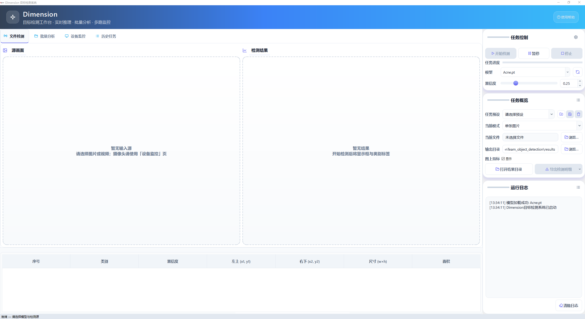
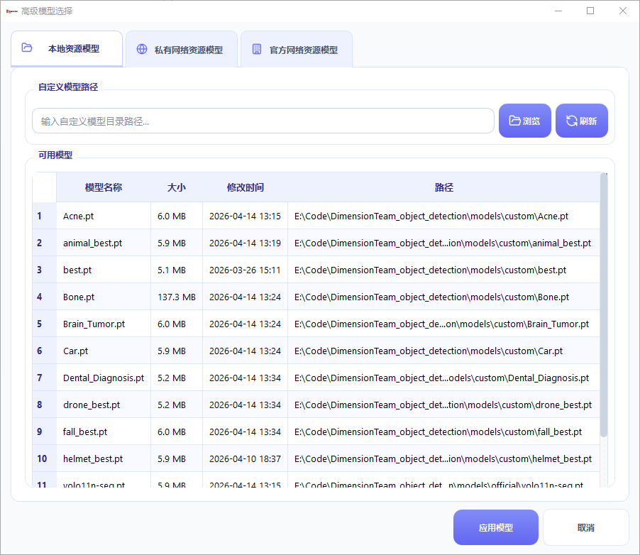

# DimensionTeam Object Detection

基于 `Ultralytics YOLO` + `PySide6` 的桌面端目标检测系统，强调**易用性、可视化、模型管理**与**批量任务效率**。  
适用于图片/视频检测、模型快速验证、项目演示与小规模生产场景。


---

## 界面预览

> 以下截图来自 `assets/ui_img/`。

### 1) 系统主界面



### 2) 模型管理界面



### 3) 项目团队logo


---

## 核心功能

- 支持多输入源：单图、视频、摄像头、文件夹批量。
- 支持本地模型扫描与高级模型选择（私有/官方资源下载）。
- 支持检测结果展示、统计信息、明细导出与历史任务记录。
- 内置使用帮助文档，支持目录导航与快速跳转。
- UI 交互持续优化：模型刷新、下载后台化、任务控制更清晰。

---

## 项目结构（关键目录）

```text
DimensionTeam_object_detection/
├── detection_main.py              # 主程序（UI + 业务逻辑）
├── run_detection_system.py        # 启动脚本（依赖检查 + 目录初始化）
├── requirements.txt
├── models/
│   ├── custom/                    # 自定义/私有模型目录
│   └── official/                  # 官方模型目录
├── docs/help_sections/            # 内置帮助文档
├── assets/ui_img/                 # README界面图片资源
└── csv_reports/                   # 模型/报表相关CSV
```

---

## 环境要求

- Windows 10/11（主力平台）
- Python 3.8+
- 建议使用虚拟环境
- 可选：NVIDIA GPU + CUDA（加速推理）

---

## 快速开始

### 1. 克隆项目

```bash
git clone https://github.com/Alaskaboo/DimensionTeam_object_detection.git
cd DimensionTeam_object_detection
```

### 2. 安装依赖

```bash
python -m venv .venv
# Windows
.venv\Scripts\activate
pip install -r requirements.txt
```

### 3. 启动程序

推荐：

```bash
python run_detection_system.py
```

或直接：

```bash
python detection_main.py
```

---

## 模型使用说明

### 本地模型

- 建议将 `.pt` 文件放在：
  - `models/custom/`
  - `models/official/`
- 程序会递归扫描 `models/` 下模型并展示到模型选择框。

### 在线模型

- 私有模型资源：通过 GitHub Release（`train_weights`）读取/下载。
- 官方模型资源：支持在高级模型选择中直接下载。

更多模型说明见：[`DATA_INTRODUCTION.md`](DATA_INTRODUCTION.md)

---

## 常见问题

- **模型列表没更新？**  
  可点击模型行旁的刷新按钮，或确认模型文件已放入 `models/` 下。

- **下载模型时卡顿？**  
  新版已改为后台下载；若网络慢，状态会显示“下载中...”，可继续操作界面。

- **模型加载失败？**  
  先确认 `.pt` 文件完整，且与当前 `ultralytics` 版本兼容。

---

## 文档与资源

- 使用帮助：`docs/help_sections/`
- 模型介绍：[`DATA_INTRODUCTION.md`](DATA_INTRODUCTION.md)
- 技术博客：<https://blog.alaskaboo.cn>

---

## 致谢

- [Ultralytics](https://github.com/ultralytics/ultralytics)
- [Qt for Python / PySide6](https://www.qt.io/qt-for-python)
- [OpenCV](https://opencv.org/)

---

## 许可证

本项目采用 MIT License（如仓库未附 LICENSE 文件，建议发布前补齐）。
